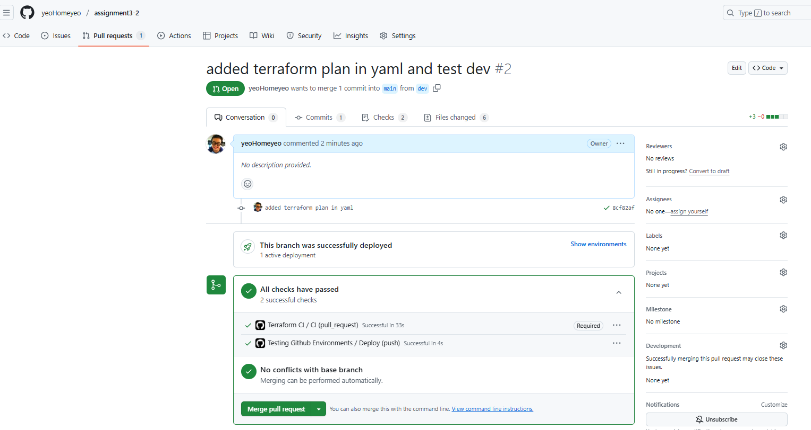
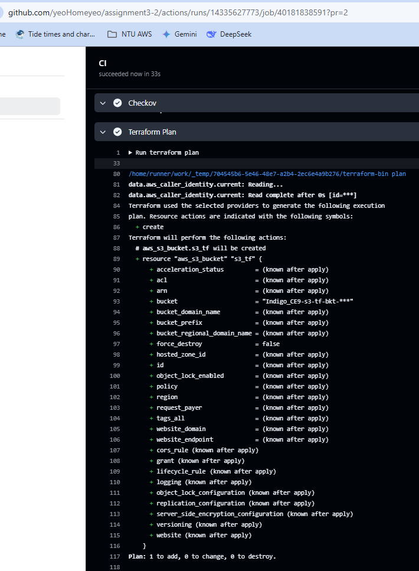
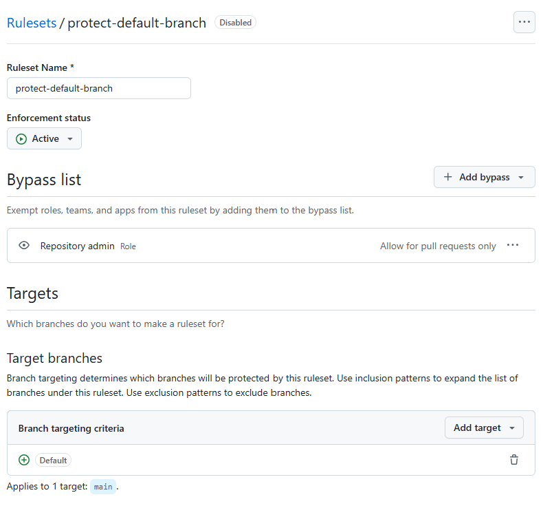
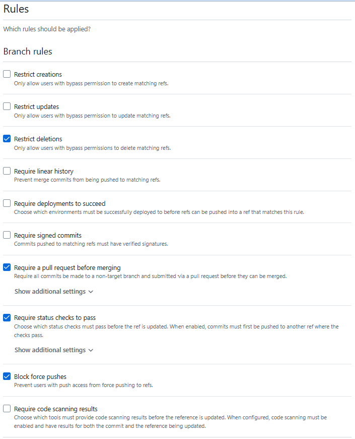

# assignment3-2

### Skip checkov warnings
Static code analysis tool that scans Infrastructure as Code (IaC) files for security misconfigurations
Helps developers and security teams identify potential security and compliance issues early in the development lifecycle, before infrastructure is provisioned

### CI check success

### Add terraform plan to YAML

### Successful terraform

### Terraform plan in workflow

### Successful Tflint checks
Static code analysis tool that scans Terraform configuration files to identify potential errors, bugs, and deviations from best practices.   

### Protect main branch

